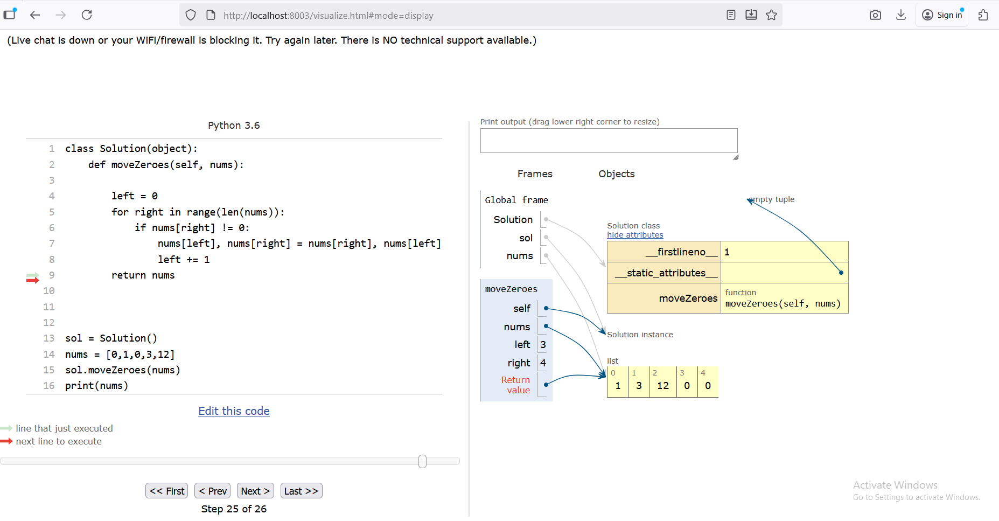

# 👋 Hi, I'm Grace Duquiza Olesen

💻 **Computer Science Student (AMAOEd)** — based in **Aarhus, Denmark**.  
After 8+ years in sales and customer service (PH • UAE • DK • NO), I’m transitioning into tech, focusing on **software development** and **AI-powered applications**.

---

### 🔗 Connect
🌐 [Portfolio](https://graceduquiza.github.io) • 💼 [LinkedIn](https://www.linkedin.com/in/grace-duquiza-olesen-9b3005137) • ✉️ [Email](mailto:duquizaolesen@gmail.com)

---

## 🚀 Projects

### 🧩 [Sudoku Learn](https://graceduquiza.github.io/SudokuGame/)
🕹️ A mobile-friendly Sudoku game built with **Vanilla JS** — includes hints, undo/redo, and a timer.

### 🇩🇰 [Danish Vocab Trainer](https://graceduquiza.github.io/Danish_Vocab_Trainer/)
📘 Flashcards + quizzes for Danish learners — simple and fun interface.

### 🥟 [Siomai Cart Sarap](https://siomaisarap2828.web.app/)
🍱 A clean, responsive menu site inspired by Filipino street food stalls.  

> ⚙️ Dynamic Work: **Sales Inventory App** (React + Express + PostgreSQL) — backend under security refinement.

---
## 🧠 Online Python Tutor (Python 3.14.0 Fork)

🔧 Updated classic **Online Python Tutor** for **Python 3.14.0** with security and compatibility fixes.  
✅ Replaced deprecated `imp` with `importlib`  
✅ Fixed regex warnings  
✅ Removed exposed API keys  

### 🖼️ Example Output

   
   
  <em>Figure 1. Example of a generated Online Python Tutor screenshot.</em>

 

---

## 📂 Folder Tree Viewer

🎯 Visualizes any folder structure as a **Mermaid.js diagram** using **Flask**.  
💡 Ideal for developers and students to understand project architecture quickly.

✅ Choose layout (TD / LR / BT / RL)  
✅ Zoom & Download as `.svg`  
✅ Excludes heavy directories (`node_modules`, `.venv`, `__pycache__`, etc.)

### 🖼️ Example Output

  
   
  <em>Figure 1. Example of a generated folder tree diagram</em>

## ⚙️ Tech Stack

🧩 **Languages:**  
Python · Java · C++ · JavaScript · SQL · HTML · CSS  

⚛️ **Frameworks & Libraries:**  
React · Vue.js · Node.js · Express.js · Flask · Django · Prisma ORM · Tailwind CSS  

🗄️ **Databases:**  
PostgreSQL · Oracle SQL  

🧰 **Tools:**  
Git · GitHub · VS Code · Docker · Render · Firebase · Railway · PlantUML · Mermaid.js · Draw.io · PowerShell  

🤖 **AI / ML:**  
TensorFlow · TensorFlow.js · NumPy · scikit-learn · CUDA *(learning stage)*

🌍 Languages

English 🇬🇧 | Filipino 🇵🇭 | Danish 🇩🇰 (learning)

Thanks for visiting! 🙌
Always exploring, building, and learning.
